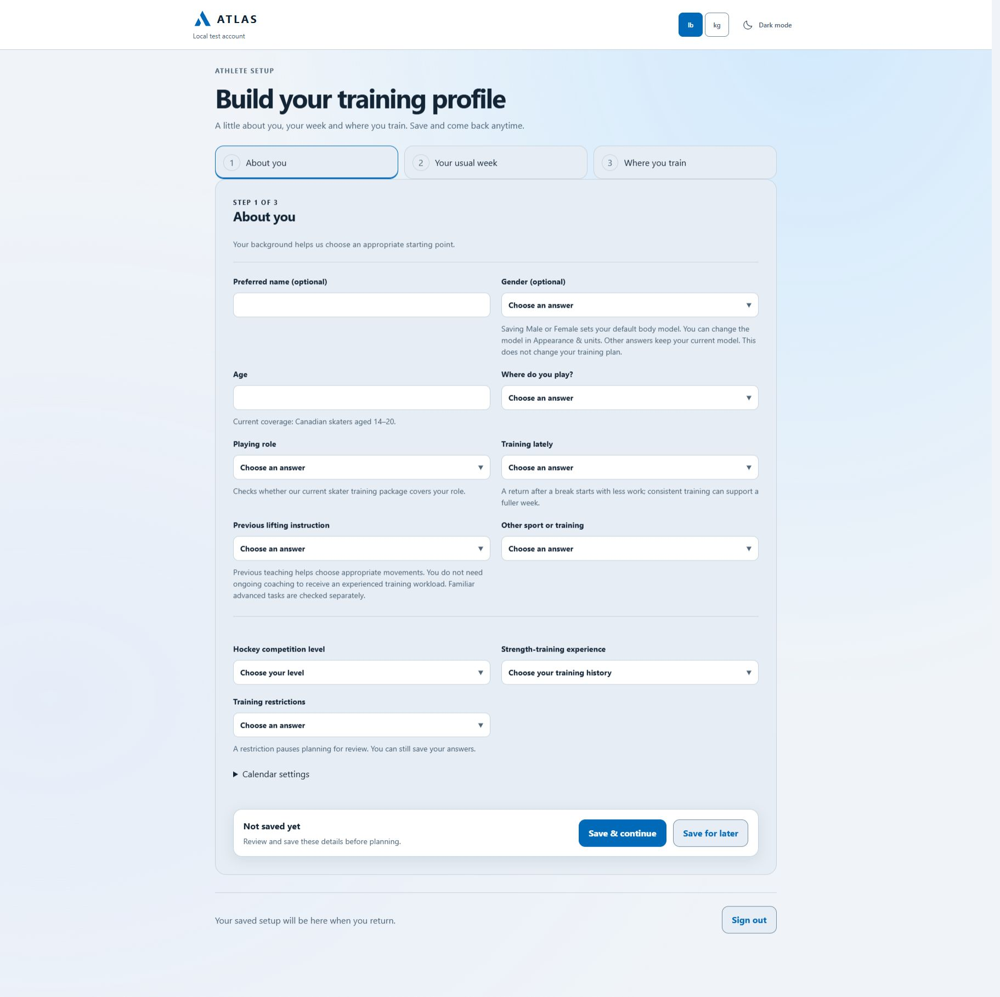
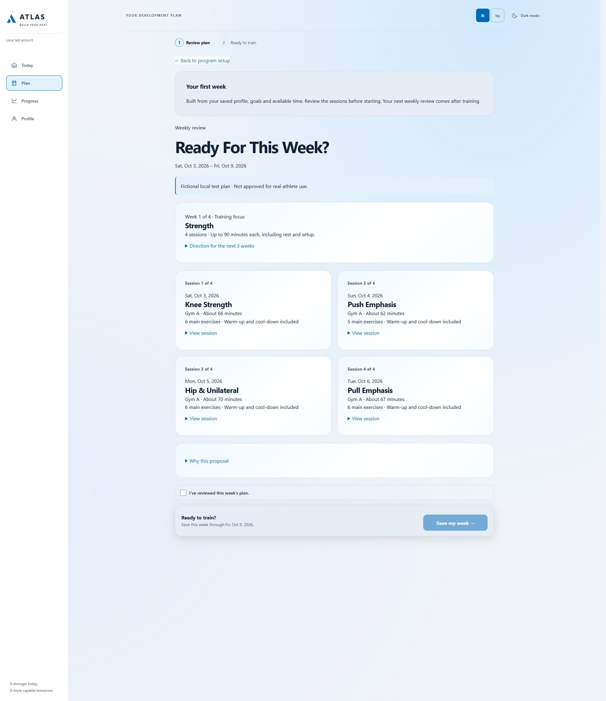
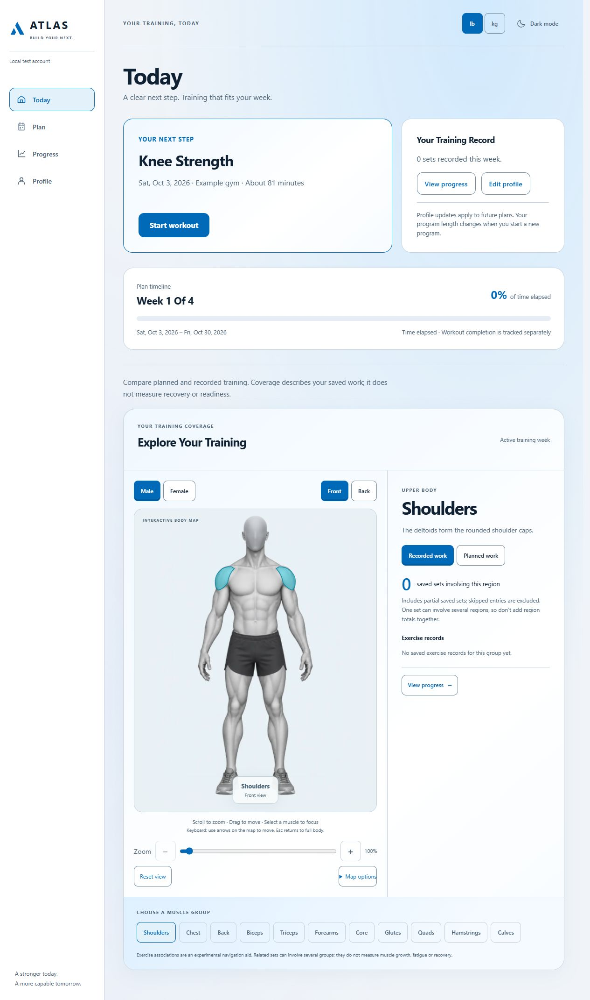
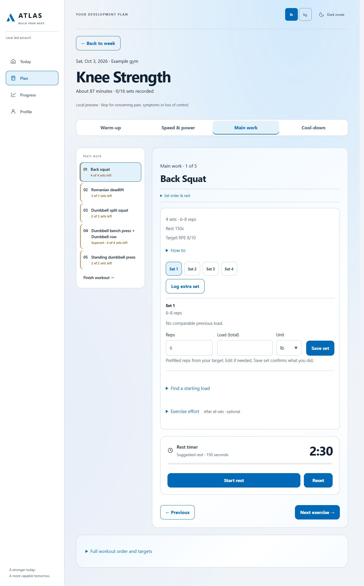
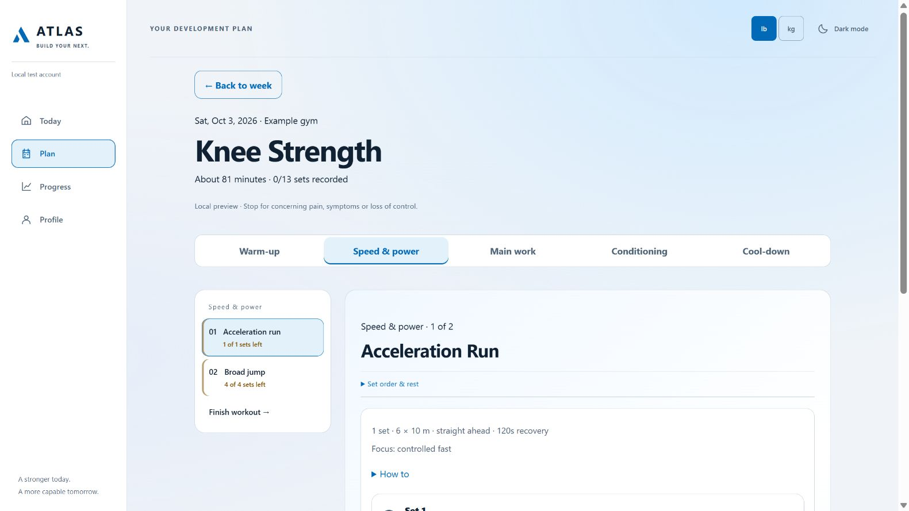

# Project Atlas

**A working local prototype for personalized athlete training, starting with hockey. Still in development.**

[See the actual app](#walk-through-the-app) · [How it works](#how-the-pieces-connect) · [Development notes](DEVELOPMENT.md) · [Development repository](https://github.com/mars0127/project-atlas)

Project Atlas grew out of my experience as an athlete and fitness enthusiast. I wanted to explore how software could make training more personal: accounting for someone's background, goals, schedule and available equipment, then using their recorded work to guide what comes next.

I'm developing and testing the project locally. The screenshots below are captures from the running application, using fictional test profiles—not concept renders. They come from recent development builds and different test states, so they are not one athlete's continuous training record. This is not yet a finished product or a publicly available training service.

## Walk through the app

### 1. Set up an athlete profile

The guided setup collects training background, the usual week and individual training locations. These inputs feed planning rather than serving as a generic questionnaire.

### 2. Review a personalized training week

An athlete chooses a 1–4-week program and reviews the proposed sessions before accepting it. The accepted program length stays fixed; later weekly reviews respond to the athlete's training record and circumstances.

### 3. Find the next workout and explore training coverage

Today brings the next action, program timeline and body map together. The map distinguishes planned work from saved work. It illustrates training coverage; it does not measure muscle growth or recovery.

### 4. Record strength work during a session

The workout view separates the session into sections, shows exercise and set targets, and lets the athlete record reps and load in pounds or kilograms. The sidebar shows unfinished sets, and the rest timer stays alongside the work.

### 5. Keep speed and power work purposeful

Field work has its own section and task-specific instructions. This example shows acceleration runs and broad jumps rather than treating every exercise as a weighted strength set.

Click any screenshot to inspect it at full size. Captured October 3–4, 2026, from local development builds.

## How the pieces connect

**Profile → program → workout records → weekly review → next week.**

The planning layer checks the athlete's context, available time, equipment and usable space. Workout records keep prescribed targets separate from what the athlete actually saved. Weekly continuation uses those records and changed circumstances to prepare the next proposal, while preserving the earlier accepted plan and history.

For example, a session should use equipment from its own gym, rather than combine equipment from two different locations. Finishing a session should preserve missing sets rather than fill them in automatically. Those details have been a large part of the development work.

## What I'm building

- A guided account and athlete-profile setup.
- Training programs that use the athlete's goals, experience, schedule and equipment.
- A workout experience with set logging, previous-set values, rest timers and clear session completion.
- Weekly reviews that account for recorded training and changing circumstances.
- Progress views and an illustrative body map showing training coverage.

The initial training package focuses on hockey off-ice performance. The broader architecture separates the shared platform from sport-specific rules.

## My role and approach

I lead the product direction, draw on my athletic experience, test the workflows and refine the requirements. I'm learning software development through the project and use AI coding tools, including Codex, to help implement and investigate changes.

Much of the work has involved asking practical questions: Does this workout suit the person who received it? Does each profile question serve a purpose? Can a new user understand what to do next? Those questions shape both the interface and the planning logic.

## Technology

- Next.js, React and TypeScript.
- Supabase authentication and PostgreSQL, running locally during development.
- Rule-based planning and adaptation; the application does not use runtime AI to generate workouts.
- Automated checks alongside hands-on workflow testing.

## Current stage

Account setup, planning, workout logging and weekly continuation are implemented locally and still being tested and refined. Training rules remain experimental. Qualified programming review, broader usability testing and release preparation are still ahead.

This repository is a visual project showcase, not a deployed training app. The [development repository](https://github.com/mars0127/project-atlas) provides code and earlier implementation history; the latest local work shown here can be ahead of its published commits. See [development notes](DEVELOPMENT.md) for implementation and verification details.

The body visualization uses MakeHuman Community graphical assets under CC0 and Three.js rendering. It is an illustrative model, not a scan of a person. Source attribution is described in the development project's `public/atlas/anatomy/ATTRIBUTION.txt`.
